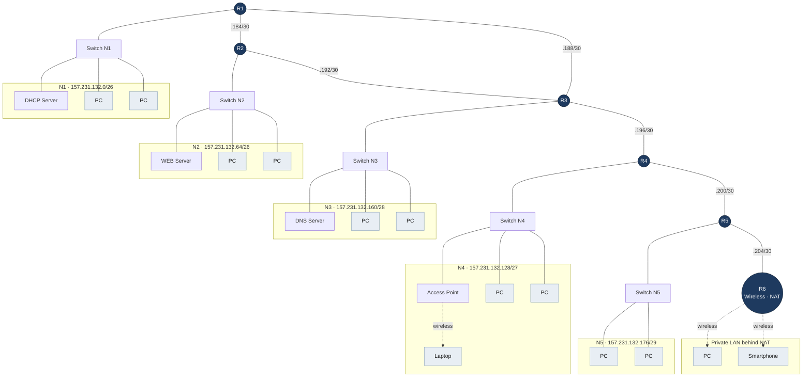

# Network Design — Cisco Packet Tracer Final Project

Final project for **Computer Networks**: a routed, multi-LAN network
built in Cisco Packet Tracer from a single assigned `/24`, split with **VLSM** so that every
subnet — including the point-to-point links between routers — is the smallest size that fits.

The network carries 6 routers, 5 switched LANs, a wireless segment behind a NAT router,
and DHCP / DNS / WEB services, with **RIPv2** as the routing protocol.


---

## Assigned problem

| | |
|---|---|
| **Network IP** | `157.231.132.0` |
| **Mask** | `255.255.255.0` (`/24`) |
| **Usable addresses** | 254 |

Host requirements per LAN:

| Subnet | Hosts required | Smallest prefix that fits |
|---|---|---|
| N1 | 60 | `/26` (62 usable) |
| N2 | 48 | `/26` (62 usable) |
| N3 | 12 | `/28` (14 usable) |
| N4 | 16 | `/27` (30 usable) |
| N5 | 4 | `/29` (6 usable) |

Note that **N4 needs a `/27`, not a `/28`** — a `/28` yields only 14 usable addresses, which is
short of the 16 required. This is the classic trap in the assignment.

---

## Addressing plan (VLSM)

Subnets are allocated **largest first**, so no address space is stranded. The six `/30`s at the
end are the router-to-router links — a `/30` gives exactly 2 usable addresses, which is the
minimum a point-to-point link can use, and satisfies the "minimum-size IP classes for
inter-router connections" requirement (worth 1.25 points).

| Subnet address | Range | Usable IPs | Hosts | Assigned to |
|---|---|---|---|---|
| `157.231.132.0/26` | .0 – .63 | .1 – .62 | 62 | **N1** (needs 60) |
| `157.231.132.64/26` | .64 – .127 | .65 – .126 | 62 | **N2** (needs 48) |
| `157.231.132.128/27` | .128 – .159 | .129 – .158 | 30 | **N4** (needs 16) |
| `157.231.132.160/28` | .160 – .175 | .161 – .174 | 14 | **N3** (needs 12) |
| `157.231.132.176/29` | .176 – .183 | .177 – .182 | 6 | **N5** (needs 4) |
| `157.231.132.184/30` | .184 – .187 | .185 – .186 | 2 | link **R1 ↔ R2** |
| `157.231.132.188/30` | .188 – .191 | .189 – .190 | 2 | link **R1 ↔ R3** |
| `157.231.132.192/30` | .192 – .195 | .193 – .194 | 2 | link **R2 ↔ R3** |
| `157.231.132.196/30` | .196 – .199 | .197 – .198 | 2 | link **R3 ↔ R4** |
| `157.231.132.200/30` | .200 – .203 | .201 – .202 | 2 | link **R4 ↔ R5** |
| `157.231.132.204/30` | .204 – .207 | .205 – .206 | 2 | link **R5 ↔ R6** |
| `157.231.132.208/28` | .208 – .223 | .209 – .222 | 14 | *free* |
| `157.231.132.224/27` | .224 – .255 | .225 – .254 | 30 | *free* |

Address utilisation: **208 of 256** addresses allocated, 48 held in reserve for growth.

The full division tree — including how each block is split from and can be re-joined into its
parent — is in [`Dividing Subnet Adresses.pdf`](Dividing%20Subnet%20Adresses.pdf).

Convention used throughout: **the router interface takes the first usable address** of its
subnet, and that address is the default gateway for every host on that segment.

---

## Topology



| Device | Role |
|---|---|
| **R1 – R5** | Cisco routers, RIPv2, one LAN each plus point-to-point links |
| **R6** | Wireless router — NAT boundary for the private wireless LAN |
| **DHCP Server** (N1) | Dynamic addressing, with per-pool default gateway and DNS options |
| **DNS Server** (N3) | Name → IP resolution for the WEB server |
| **WEB Server** (N2) | HTTP, reachable by name from every machine in the network |
| **Access Point** (N4) | Bridges the laptop into N4 — a **layer-2** extension, not a separate subnet |

The access point does **not** create a new subnet: the laptop associated with it receives an
address from **N4**'s range, because an AP bridges rather than routes.

---

## Implementation notes

### Routers with more than two neighbours

R3 has three router neighbours plus its own LAN. Stock Packet Tracer routers ship with only
two Ethernet ports, so extra interfaces must be added:

1. **Power off** the router (click the power switch in `Physical`).
2. Add a `WIC-1ENET` module (or any Ethernet / Fast Ethernet / Gigabit Ethernet card).
3. **Power the router back on.**

Ports cannot be added while the device is running, and skipping the power-cycle is the usual
reason a cable refuses to connect or comes up as `Serial`.

### Routing — RIPv2

```
Router> enable
Router# configure terminal
Router(config)# router rip
Router(config-router)# version 2
Router(config-router)# network 157.231.132.0
Router(config-router)# network <directly-connected-network-2>
Router(config-router)# network <directly-connected-network-3>
Router(config-router)# end
Router# write memory
```

Advertise **every directly connected network** on each router, including the `/30` transit
links. `version 2` is required — RIPv1 is classful and will not carry the VLSM masks used
here, so the `/26`, `/27`, `/28`, `/29` and `/30` prefixes would be summarised into nonsense.

Static routes would earn only half the points for this item; RIP is the intended solution.

### NAT — the private wireless network behind R6

Everything behind R6 is treated as a private network; the rest of the topology is "the
Internet" from its point of view. Traffic leaving R6 is rewritten to appear to come from R6
itself, so no outside host can address the wireless clients directly.

```
Router# configure terminal
Router(config)# interface fastethernet0/0        ! outside — towards R5
Router(config-if)# ip nat outside
Router(config-if)# exit
Router(config)# interface fastethernet0/1        ! inside — private wireless LAN
Router(config-if)# ip nat inside
Router(config-if)# exit
Router(config)# ip route 0.0.0.0 0.0.0.0 <next-hop-on-R5>
Router(config)# access-list 1 permit <private-net> <wildcard>
Router(config)# ip nat inside source list 1 interface fastethernet0/0 overload
Router(config)# end
Router# write memory
```

The access list takes a **wildcard mask, not a netmask** (`0.0.0.255` for a `/24`) — mixing
the two up is the most common cause of NAT silently not matching any traffic.

**Verifying it works:** ping an outside host from a private client — the `Reply from` will show
**R6's** address rather than the client's. In Simulation mode, inspect the `src` field of the
packet before and after it crosses R6.

### Port forwarding (bonus)

NAT only covers connections opened from the inside. To expose an inside service to the
outside, map the port explicitly:

```
Router(config)# ip nat inside source static tcp <inside-ip> 80 <outside-ip> 80
Router(config)# ip nat inside source static tcp <inside-ip-2> 80 <outside-ip> 81
```

Two servers both listening on port 80 can be published on different outside ports (`:80` and
`:81`), which is exactly what the second line does.

### Save every configuration

Router state lives in RAM until it is written to NVRAM. An unsaved router loses everything on
reload, and the project is graded on a reopened file:

```
Router# write memory
```
or
```
Router# copy running-config startup-config
```

---

## Requirements checklist

The grading breakdown from the course page, and where each item is realised:

| Requirement | Pts | Where |
|---|---|---|
| Network design | 0.25 | Topology above |
| Correct cabling | 0.25 | `.pkt` file |
| Splitting the assigned IP domain into subclasses | 0.5 | [Addressing plan](#addressing-plan-vlsm) |
| Static IP assignment | 0.5 | Servers, router interfaces |
| DHCP-assigned IPs | 0.75 | DHCP server in N1 |
| Correct default gateways | 0.75 | First usable address of each subnet |
| Pinging devices on another physical network | 0.5 | End-to-end via RIP |
| Correct route configuration (RIP; half credit for static) | 1 | RIPv2 on R1–R5 |
| DNS server configured and used | 1 | DNS server in N3 |
| WEB server reachable from any machine | 1.5 | WEB server in N2, resolved by name |
| Minimum-size IP classes for inter-router links | 1.25 | Six `/30`s, `.184` – `.207` |
| NAT in one network | 0.75 | R6, wireless LAN |
| Able to explain any implementation detail on request | 1 | This document |
| **Total** | **10** | |

**Mini-bonus:** a trunk link between two switches serving a real purpose; port forwarding for
the web server.
**Bonus:** a router with a single cable/port carrying multiple VLANs (router-on-a-stick).

---

## Repository contents

| File | Description |
|---|---|
| `Final Project CISCO.pkt` | The Packet Tracer simulation — the deliverable |
| `Dividing Subnet Adresses.pdf` | VLSM division tree and the full subnet table |
| `Screenshot Final Project CISCO.png` | Topology overview and the assigned problem statement |
| `README.md` | This document |

## Opening the project

1. Install **Cisco Packet Tracer** (free with a Cisco Networking Academy account).
2. Open `Final Project CISCO.pkt`.
3. Use **Simulation** mode to watch packets traverse the network hop by hop — the clearest way
   to demonstrate routing, DNS resolution and NAT translation.

Useful checks from any PC's Command Prompt:

```
ipconfig /all                     # confirm DHCP lease, gateway and DNS server
ping <ip-in-another-subnet>       # confirm inter-network routing
nslookup <web-server-name>        # confirm DNS resolution
```

…then open the web server by **name** in the PC's Web Browser to prove DNS and HTTP together.
